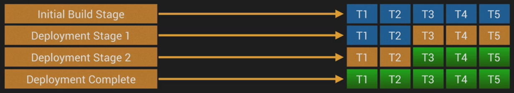
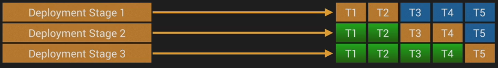
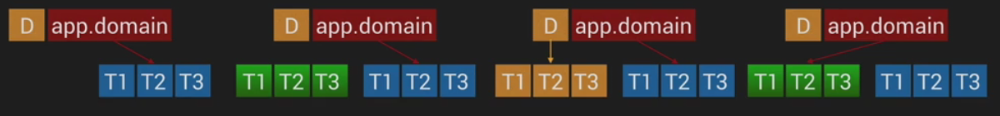

# CI/CD

CI is a process of automating regular code commits followed by an automated build and terst process designed to highlight intergration issues early

The CD server automates the deployment into a working Quality Assurance, Pre-Production or prod env.

AWS tools:
- CodeDeploy
- CodePipeline

## Deployment Types

### Single target deployment

- small development projects, legacy infra
- build -> target

### all-at-once deployment

```
                           +------------+
      +------------------->   Target   |
      |                   +------------+
+-----+----+
|  Build   |
+-----+----+
      |                   +------------+
      +------------------->   Target   |
                          +------------+

```

- More complicated than single target, requires orchestration
- no ability to test, small deployment outages, less than ideal rollback
- works ok for 5-10 targets

### min in-service deployment

initial build stage - all targets are online
deployment stage 1 - update all targets, but keep mininum online
deployment stage 2 - update instances kept online in stage 1



- multiple stages
- deployment to as many targets as possible
- orchestration and health checks are required
- automated testing, deployment targets are assessed and tested prior to continuing
- generally no downtime
- quicker and less stages than rolling deployment

### rolling deployment

- multiple stages, number of targets per stage is user-defined
- orchestration and health checks are required
- overall applicable health isn't necessarily maintained
- can be the least efficient deployment time based on time-taken
- automated testing, deployment targets are assessed and tested prior to continuing
- no downtime
- can be paused, allowing limited multi-version testing

 

### Blue Green deployment

1. current - blue
2. add new env as green
3. install new app version in green
4. switch traffic to green
5. ok or rollback to blue



- advanced orchestration tooling
- significant cost, maintaining 2 env for the duration of deployments
- deployment is rapid, entire env is deployed at once
- cutover and migration is clean and controlled (DNS switch)
- easy rollback
- health and performance of entire `green` env can be tested prior to cutover
- can be fully automated