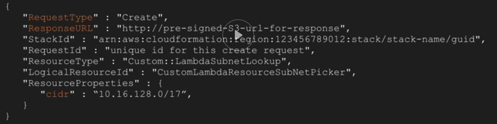
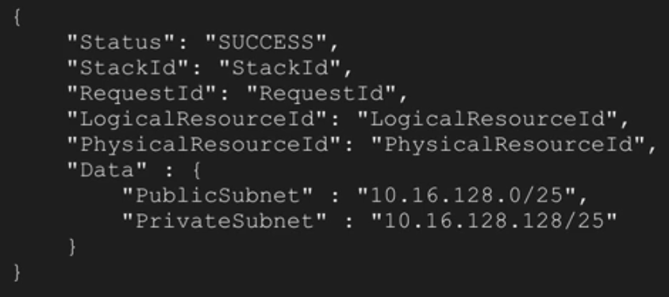
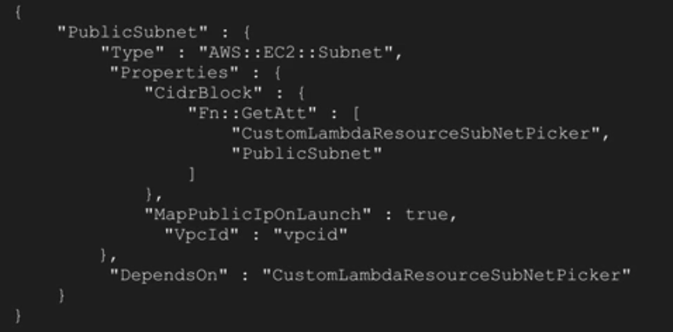

# Cloudformation (cfn)

- BeanStalk uses cfn
- automatic rollback on error is enable by default
- you are charged for errors
- cloudformation is free
- stacks can wait for apps using the `WaitCondition`
- `Fn:GetAtt` to output data
- IAM Role Creation and Assigment is also supported

## cfn build blocks
- stack
- template
- stack policy (statement which governs what can be changed and by who)

### Templates anatomy

- *params*
- *mappings* (hashes)
- resources
    ```
    actual resrouces
    ```
- *outputs*

### Parameters

#### Types

- String
- Number
- List
- CSV list
- AWS specific types, `AWS::EC2::KeyPair::KeyName`, `AWS::EC2::AvailabilityZone::Name`
- SSM Parameter Types (doesn't currently support the SecureString Systems Manager parameter type)

#### properties

- maximum of 60 parameters in template
- params can have default values
- allowed values (predefined values)
- allowed (regexp) pattern]
- min & max for numbers
- min & man lenght for strings
- `NoEcho` - mask the parameter value when a call is made that describes the stack
- use `Ref` to reference a parameter, can reference own params and outputs
- supports grouping and sorting via `AWS::CloudFormation::Interface` metadata key

### Resources

- mandatory section
- logical ID (friendly name) is mandatory

## Intrinsic functions and conditionals

- `Fn::Base64`
    ```
    { "Fn::Base64": "yum -y update && yum -y upgrade" }
    ```
- `Fn::FindInMap`
    ```
    "myEC2Instance" : {
        "ImageId" : { "Fn::FindInMap" : [ "RegionMap", { "Ref" : "AWS::Region" }, "x86"]}
    }
    ```
- `Fn::GetAtt`
    ```
    { "Fn::GetAtt" : [ "logicalNameOfResource", "attributeName" ]}
    ```
- `Fn::GetAZs`
    ```
    { "Fn:GetAZs" : "region" }
    ```
- `Fn::Join`
    ```
    "Fn::Join" : [ ":", ["a","b","c"] ] -> "a:b:c"
    ```
- `Fn::Select`
    ```
    { "Fn::Select" : [ "0", { "Fn:GetAZs" : "" } ] }
    ```
- Ref
    ```
    "SubnetId" : { "Ref" : "MySubnet" }
    ```

### Conditionals

- `Fn::And`
- `Fn::Equals`
    ```
    "isProduction": {
        "Fn:Equals": [ { "Ref" : "platform"}, "production" ]
    }
    ```
- `Fn::If`
    ```
    { "Fn::If" : ["production", "m4.xlarge", "t2.small"] }
    ```
- `Fn::Not`
- `Fn::Or`

## Stack creation && DependsOn

-> S3 -> syntax check -> stack name & params verification & ingestion -> processing & creation ->
-> resource ordering -> resource creation -> output generation -> complete/rollback

### DepensOn

built in ordering vs custom ordering

Also affects:
- delete
- update
- rollback

```
"EC2": {
    "Type" : "AWS::EC2:Instance",
        "DependsOn" : "RDS" (or ["RDS1", "RDS2"])
}
```

### Resource deletion policies

- Delete (default)
- Retain
- Snapshot (Volumes, RDS, Redshift)

```
"S3Bucket" : {
    "Type": "AWS::S3::Bucket",
    "DeletionPolicy" : "Retain" (NB! Not a object property, but top-level resource property)
}
```

### Stack updates

- Check if user have rights to make the changes

Stack policies:
- all updates are allowed by default
- can be deleted, if applied
- default implicit deny for all objects

Anatomy:
- statement
    - effect
    - resource | notresource
    - principal (for stack policices is "*")
    - action (`Update:*`, `Update:Modify|Replace|Delete`)
    - condition

Updates:
- no interruption
- some interruption
- replacement
- delete

### Nesting

```
+---------------------------------+
|                                 |
| Parent stack                    |
|    +                            |
|    |    +-------------+         |
|    +----> Infra Stack |         |
|    |    +-------------+         |
|    |           |outputs         |
|    |    +------v---------+      |
|    +----> Database stack |      |
|    |    +----------------+      |
|    |           |outputs         |
|    |           v                |
|    +---->App provisioning       |
|                                 |
|                                 |
+---------------------------------+

```

Why:
- split templates
- limits: 460k template limit, 200 resource limits, 60 params, 60 outputs, 100 mappings
- IAAS reuse

```
AWS::CloudFormation::Stack
"DBStack": {
    "Type" : "AWS::CloudFormation::Stack",
    "Properties" : {
        "TemplateURL" : "https://s3.example.com/template.json"
        "Parameters" : {
            "VPC" : {"Fn:GetAtt" " ["Infra", "Outputs.VPC"]}
        }
    }
}
```

### Creation Policies / Wait conditions / Handlers

- DependsOn
    ```
    Waits for resource to be created (fails with NAT gw in dependant EC2 instance)

    ```
- Creation Policies (only for EC2 and ASGs currently)
    - policy definition
        ```
        "AutoScalingGroup": {
          "Type": "AWS::AutoScaling::AutoScalingGroup",
          "Properties": {
            ...
            "DesiredCapacity" : "2"
          },
          "CreationPolicy": {
            "ResourceSignal": {
              "Count": "2",
              "Timeout": "PT5M"
            }
          }
        }
        ```
    - signal configuration
        ```
        "UserData": {
          "Fn::Base64": {
            "Fn::Join" [ "", [
              "/opt/aws/bin/cfn-signal -e $0 ",
              "  --stack ", { "Ref": "AWS::StackName" },
              "  --resource AutoScalingGroup " ,
              "  --region ", { "Ref" : "AWS::Region" }, "n"
            ] ]
          }
        }
        ```
- Wait conditions
    * wait condition handler is CF resources with no properties, but it generates a signed URL which can be used to communicate success or failure
    * you can have a complex order, waitCondition could depend on many resources, and have many resources depending on it
    * additional resources can depend on the waitcondition - you can influence order by using dependson with waitconditions
    * additional data can be passed back via the Signed URL generated by a waitConditionHandler
        * HTTP request message using the presigned URL. The request method must be PUT and the Content-Type header must be an empty string or omitted. The request message must be a JSON structure
            ```
            {
                "Status" : "StatusValue",
                "UniqueId" : "Some UniqueId",
                "Data" : "Some Data",
                "Reason" : "Some Reason"
            }
            ```
    - Four components:
        * depends or resource you are waiting on
        * a Handle property references the above handle (URL)
        * response timeout
        * count - default is 1
        ```
        WebServerGroup:
        Type: AWS::AutoScaling::AutoScalingGroup
        Properties:
            AvailabilityZones:
                Fn::GetAZs: ""
            LaunchConfigurationName:
                Ref: "LaunchConfig"
            MinSize: "1"
            MaxSize: "5"
            DesiredCapacity:
                Ref: "WebServerCapacity"
            LoadBalancerNames:
            -
                Ref: "ElasticLoadBalancer"
        WaitHandle:
            Type: AWS::CloudFormation::WaitConditionHandle
        WaitCondition:
            Type: AWS::CloudFormation::WaitCondition
            DependsOn: "WebServerGroup"
            Properties:
                Handle:
                    Ref: "WaitHandle"
            Timeout: "300"
            Count:
                Ref: "WebServerCapacity"
        ```

### Custom resources

CF limitations:
- not all features of all AWS services are supported
- can't operator on non AWS resources
- cloudformation is not a programming language
- ability to interact with external services as part of stack operations is limited

Custom resource is backed by SNS or Lambda
- "Type" : "Custom::%ResourceName%"
- "ServiceToken" : "arn:aws:sns:ap-southeast-2:12345678910:snp" <- SNS topic to put notification to
    - when a stack is created|updated|deleted a SNS notification is sent to a topic containing the event, and a payloads
    - with lambda -> lambda function is invoked and passed an event with the same info.



Respond payload:

- Status: allows CF to complete creation of custom resource (or fail)
- StackId/RequestId: must match with values in request
- Physical & Logical ResourceId: physical is uniq for each object, logical - name of object
- data: provide custom values



## CLI commands
- `describe-stacks`
- `create-stack --template-url|--template-body file://template.json --parameters file://params.josn`
- `delete-stack`
- `validate-template`

## Helper scriptw

- `cfn-init`: Use to retrieve and interpret resource metadata, install packages, create files, and start services.
- `cfn-signal`: Use to signal with a CreationPolicy or WaitCondition, so you can synchronize other resources in the stack when the prerequisite resource or application is ready.
- `cfn-get-metadata`: Use to retrieve metadata for a resource or path to a specific key.
- `cfn-hup`: Use to check for updates to metadata and execute custom hooks when changes are detected.


## Links

- https://docs.aws.amazon.com/AWSCloudFormation/latest/UserGuide/cfn-signal.html
- https://docs.aws.amazon.com/AWSCloudFormation/latest/UserGuide/aws-properties-waitcondition.html
- https://docs.aws.amazon.com/AWSCloudFormation/latest/UserGuide/using-cfn-waitcondition.html#using-cfn-waitcondition-signaljson
- https://docs.aws.amazon.com/AWSCloudFormation/latest/UserGuide/aws-template-resource-type-ref.html
- https://docs.aws.amazon.com/AWSCloudFormation/latest/UserGuide/parameters-section-structure.html
