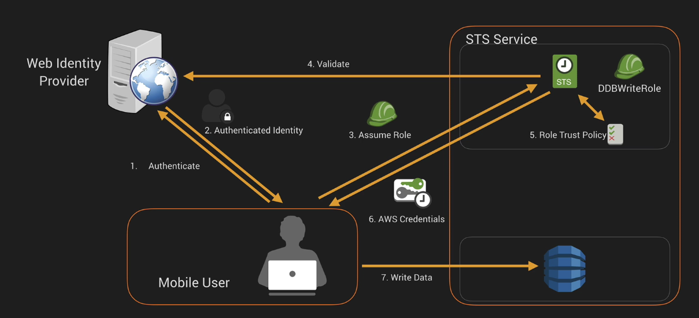
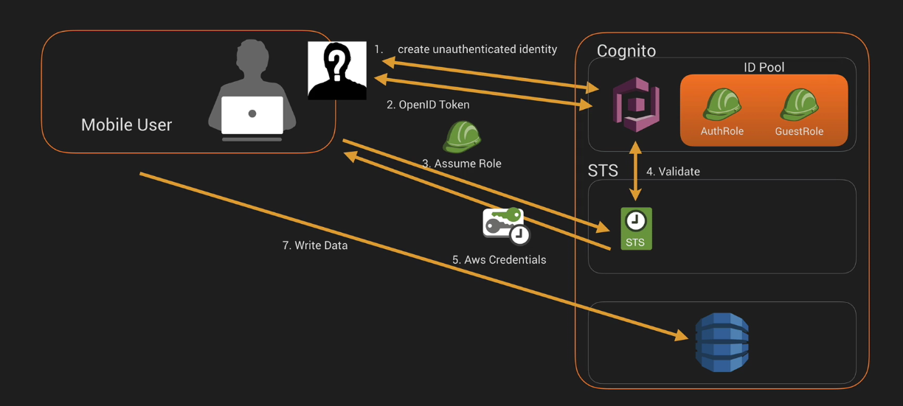
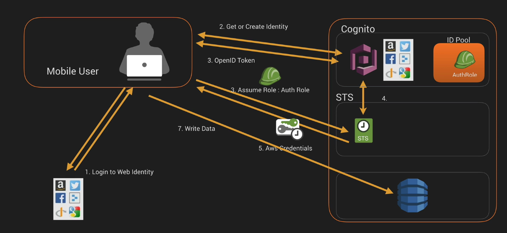
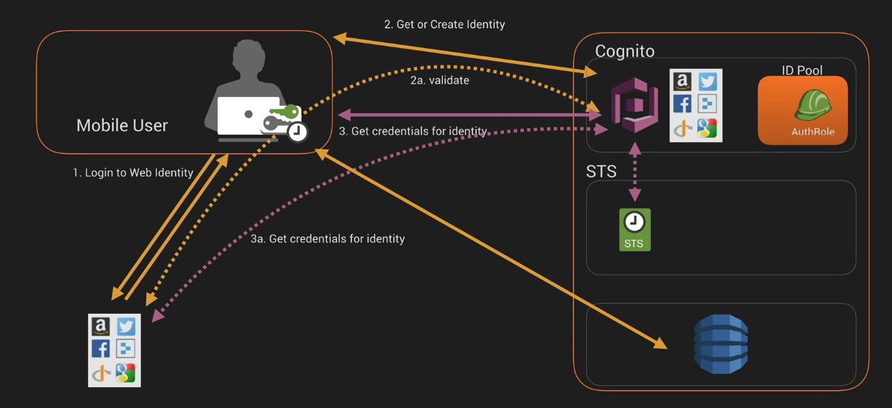
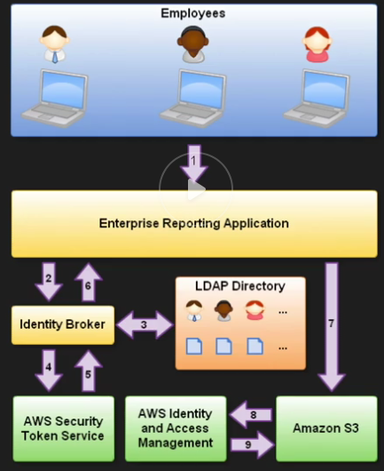

# Deleagation/Federation

Congito FAQ

## Active Directory Federation

- User -> ADFS
- ADFS -> AD
- ADFS -> SAML assertion -> User
- User -> SAML assertion -> AWS sign-in endpoint -> AssumeRoleWithSAML
- Access to console granted

## Web Identity Federation

Access using facebook, google, etc

- login to facebook
- get access token
- get temp security creds with `AssumeRoleWithWebIdentity` request (assumes some role)
- access resources using assumed role

### Cognito
- identity
- sync

### identity pool
- collection of identities, it allows grouping of identities from different providers as a single entity
- allows identities to persist across devices
- two roles: authenticated/guests

workflows:
auth identities - classic

auth identities - enhanced

## Role types

- AWS Service Role
- AWS service-linked roles
  * Lex bots and channels
- Role for cross-account access
- Role for identity provider access
  * access for idP users to AWS account

## Security Token Service

Grants users limited and temp access to AWS

Expiration timeouts:
- `AssumeRole`, min 15 min, max 1 hour, default 1 hour
- `GetFederationToken`, 15 min, 36 hours max, default 12 hours

`GetFederationToken` **doesn't support** MFA

Users from three sources:
* Federation
    * SAML
    * Temp access based off the users AD credentials
    * SSO
* Mobile apps
    * Facebook/Amazon/Google/OpenID
* Cross account access

### Terms

- Federation
    * joining list of users in one domain with a list of users in another domain
- Identity Broker
    * a service that allows you to take an identity from point A and join it to point B
- Identity Store
    *  AD, Facebook, Google
- Identities
    * users

#### Scenario 1

* Develop an Identity Broker to communicate with LDAP and STS
* Identity broker -> LDAP -> AWS STS
* Credentials -> App -> Access to resources

#### Scenario 2

* Develop an Identity Broker to communicate with LDAP and STS
* Identity broker -> LDAP -> IAM role for user
* Credentials -> App auth to STS -> Assume role -> Access to resources

# TODO

- configure external idP