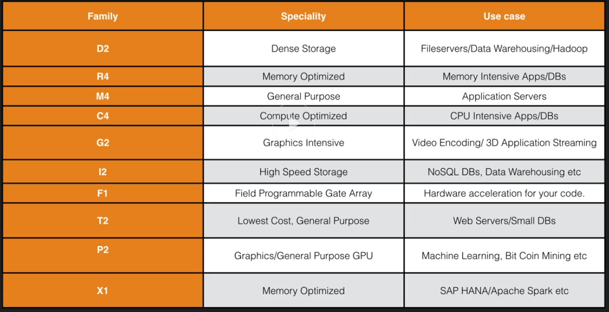

# Elastic Compute Cloud

VM in Cloud.

### EC2 pricing options
- on demand, by the hour (or by the second, linux only)
    * low cost adn flexibility without up-front payments
    * app with short term, spiky workloads
    * developing/testing apps
- reserved (1-3 year contracts, платить заранее)
    * steady state or predictable usage
    * app requires reserved capacity
    * upfront payments to reduce costs
        * Standard RI's (up to 75% off on demand)
        * Convertible RI's (up to 54% off on demand)
            * ability to change attributes of the RI
            * `>=` instance size
        * scheduled RI's (recurring load)
- spot instances
    * apps with flexible start and end times
    * apps that are only feasible at very low compute prices
    * urgent computing needs for large amounts of additional capacity
    * you terminate - you pay for the hour
    * AWS terminates - you get the hour it was terminated in for free
- dedicated hosts - physical EC2 servers (For licenses)
    * regulatory requirements
    * licensing without multi-tenancy support or cloud deployments
    * available on-demand (hourly)
    * 70% off with reserved instance

### DR MC GIFT PiX



- D - (DENSE) dense storage
- R - (RAM) memory optimized
- M - (MAIN) general purpose
- C - (CPU) compute optimized
- G - (Graphics) graphics optimized
- I - (IOPS) high speed storage
- F - (FPGA)
- T - lowest cost, general purpose
- P - (PICS) - graphics/general purpose GPU
- X - Extreme RAM - memory optimized

## Types

- HVM
- PV

## Security groups

Security groups are stateful.
- all inbound is blocked by default
- all outbound is allowed by default
- changes take effect immediately
- any number of EC2 instances within a security group
- multiple groups per EC2 instance
- no block rules

## Metadata

http://169.254.169.254/latest/meta-data/
http://169.254.169.254/latest/user-data/

## Gothas

- default action is for the EBS to be deleted when the instance is terminated
- termination protection is off by default
- can't encrypt boot volume for standard AMIs
- one subnet - one AZ
- 20 on-demand instances across the instance family by default
- Nitro hypervisor (new, foc C5) vs Xen
- SRV-IO on HVM AMI with drivers, ENA elastic network adapter
- no additional fee for enhanced networking

## AMIs

- AMIs are regional
- can copy between regions (console, command line, API)

## Q. What is a cluster placement group?

A cluster placement group is a logical entity that enables creating a cluster of instances by launching instances as part of a group. The cluster of instances then provides low latency connectivity between instances in the group. Cluster placement groups are created through the Amazon EC2 API or AWS Management Console.

# Autoscaling life-cycle hooks

50 hooks per group maximum

After you add lifecycle hooks to your Auto Scaling group, they work as follows:
- Responds to scale out events by launching instances and scale in events by terminating instances.
- Puts the instance into a wait state (`Pending:Wait` or `Terminating:Wait`). The instance is paused until either you continue or the timeout period ends.
- You can perform a custom action using one or more of the following options:
    - Define a CloudWatch Events target to invoke a Lambda function when a lifecycle action occurs. The Lambda function is invoked when Amazon EC2 Auto Scaling submits an event for a lifecycle action to CloudWatch Events. The event contains information about the instance that is launching or terminating, and a token that you can use to control the lifecycle action.
    - Define a notification target for the lifecycle hook. Amazon EC2 Auto Scaling sends a message to the notification target. The message contains information about the instance that is launching or terminating, and a token that you can use to control the lifecycle action.
    - Create a script that runs on the instance as the instance starts. The script can control the lifecycle action using the ID of the instance on which it runs.
- By default, the instance remains in a wait state for one hour, and then the Auto Scaling group continues the launch or terminate process (`Pending:Proceed` or `Terminating:Proceed`). If you need more time, you can restart the timeout period by recording a heartbeat. If you finish before the timeout period ends, you can complete the lifecycle action, which continues the launch or termination process.


## Wait State

- default timeout is 1 hour, max is 48 hours or 100 times * heartbeat timeout, whichever is smaller.
- adjust timeout with:
     - heartbeat timeout for hook when creating hook. Use `put-lifecycle-hook` command with `--heartbeat-timeout` parameter. Or use `PutLifecycleHook` op with `HeartbeatTimeout` param.
     - Continue to the next state with `complete-lifecycle-action` command or the `CompleteLifecycleAction` operation.
     - Restart timeout period by recording a heartbeat, using `record-lifecycle-action-heartbeat` command or the `RecordLifecycleActionHeartbeat` op. This increments the heartbeat timeout by the timeout value specified when you created the lifecycle hook. If the timeout is 1 hour, and you call this comamand after 30 minutes, the instance remains in a wait state for an additional hour.

## Cooldowns and custom actions

The cooldown period is a configurable setting for your Auto Scaling group that helps to ensure that it doesn't launch or terminate additional instances before the previous scaling activity takes effect. After the Auto Scaling group dynamically scales using a simple scaling policy, it waits for the cooldown period to complete before resuming scaling activities.

Default cooldown is 300 seconds (5 minutes)

`scale out -> hoook -> 'Pending:Wait' -> scaling actions are suspended -> 'InService' -> cooldown starts -> resume scaling actions after cooldown
`

## Health Check

Health check grace period doesn't start until you complete the lifecycle hook and the instance enters the `InService` state.

## Action result

### Continue

Launching: success, can be put into service.
Terminating: both ABANDON and CONTINUE allow instance to terminate, continue allows other lifecycle hooks to complete.

### Abandon

Launching: actions were unsuccessful, instance can be terminated
Terminating: stops any remaining actions, such as other lifecycle hooks

## Spot Instances

hook doesn't prevent an instance from terminating due to a change in spot price. You must still complete lifecycle action.

## Notifications

- Cloudwatch events
- SNS
- SQS

## Enter and Exit Standby
```
aws autoscaling enter-standby
aws autoscaling exit-standby
```

- Instance in an InService state can be moved toStandby state.
- Standby state enables you to remove the instance from service, troubleshoot or make changes to it, and then put it back into service.
- Instances in a Standby state continue to be managed by the Auto Scaling group. However, they are not an active part of the application until they are put back into service.

## EBS

- EBS are placed in a specific AZ, where they are automatically replicated. (Not to different AZ, but between SANs)
- cannot mount to multiple instances
- EC2 and EBS volume have to be in the same AZ
- can't modify standard volume, can change volume size and storage type on the fly

### Bootable:
- Magentic standard (bootable)
- GP2
- IO1

### Volume types

- GP2, general purpose SSD
    * 3 IOPS per GB with up to 10k IOPS, burst up to 3k IOPS
    * up to 160 MB/s
- Provisioned IOPS SSD (IO1)
    * I/O intensive
    * if you need >10k IOPS
    * provision up to 20k IOPS
    * up to 320 MB/s
    * 30 IOPS per GB of storage max
- Throughput optimized HDD (ST1)
    * big data
    * data warehouses
    * Log processing
    * sequential data
    * cannot be a boot volume
- Cold HDD (SC1)
    * low cost
    * file server
    * cannot be a boot volume
- Magnetic (Standard)
    * bootable
    * lowest cost


### Bursting

I/O Credits

when required more than the baseline performance I/O, EBS will use I/O credits to burst performance level, up to 3k IOPS

- 5400000 I/O credits initially
- enough for 3k IOPS for 30 minuntes
- earn credits when not going over provisioned IO level

### Snapshots

- snapshots exist on S3
- snapshots are point in time copies of volumes
- snapshots are incremental
- you can create AMIs from volumes and snapshots
- to move EC2 volume from one AZ/region to another - take a snap or an image, then copy it to the new region
- snaps of encrypted volumes are encrypted automatically
- volumes restored from encrypted snapshots are encrypted automatically
- you can share snapshots, but only unecrypted
    * snap can be shared with other AWS accounts or made public
- snapshot for root EBS volumes -> stop the instance before taking the snapshot

### Instance store

- Ephemeral storage
- can't stop. If the underlying host fails - will lose data
- EBS backed can be stopped
- Can reboot both

## Pre-warming EBS volumes

Restoring volumes from snapshots -> read all block from volume before using -> pre-warming

## Cloudwatch metrics

- Read|Write Byets
- Read|Write Ops
- Total Read|Write Time
- IdeTime
- *QueueLength* - number of IO waiting to be completed
- ThroughputPercentage
- ConsumedReadWriteOps

## Status checks

- ok
- warning
    ```
    (severely) degraded, but available
    ```
- impaired (stalled/not available)
    ```
    volume offline/pending recovery, or waiting for the user to enable I/O

    ```
- insufficient-data

## Modifying EBS volumes

- online size change
- change volume type or adjust IOPS performance

----------

## Links

- https://docs.aws.amazon.com/AWSEC2/latest/UserGuide/Storage.html
- https://docs.aws.amazon.com/AWSEC2/latest/UserGuide/monitoring-volume-status.html
- https://docs.aws.amazon.com/AWSEC2/latest/UserGuide/ebs-initialize.html

### to-do
- EC2 snapshots, data migration