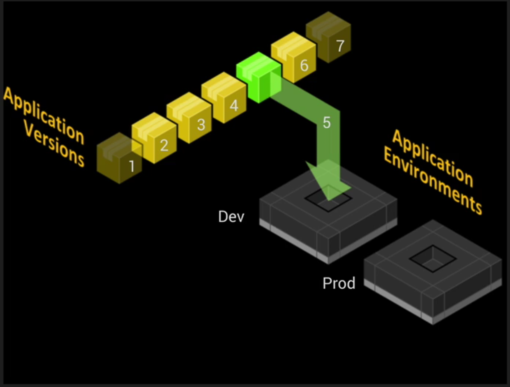
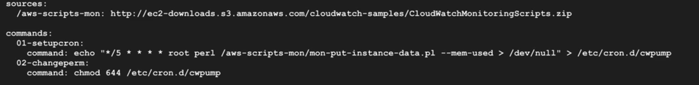
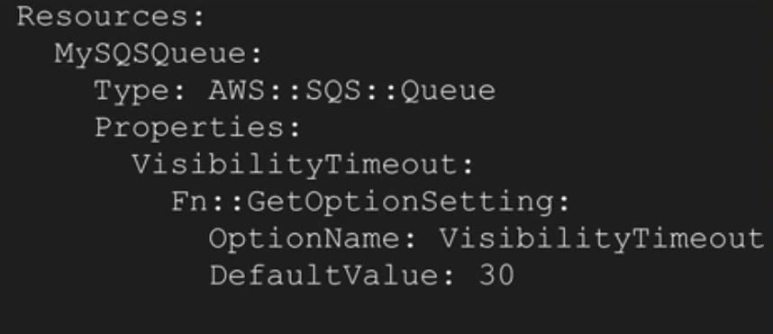

# Beanstalk

zip -> beanstalk -> AWS resources
----

* removes/simplifes infra management
* allows SSH access to instances

Apps are the high level structure in beanstalk.

- Entire app is one EB application
- Each logical component of you app, can be a EB app or a EB env within an application.

App can have multiple env or functional type
* single vs scalable
* web servers envs or worker envs
* each app have its own URL, URLs can be swapped between apps

----

* app version are unique packages which represent versions of apps
* app is uploaded to EB as a app bundle - zip
* app can have many versions
* app versions can be deployed to environments within an Application



## Env types

### web server
- present app to users/interact with outher services, generating outputs for processing
### worker
- process output from other envs

## .ebextensions

config folder in bundle, contains %yaml%.conf files. It allows configuration of the EB env and customisation of the resources it contains (EC2, ELB, etc)

### syntax
- option_settings - global config options
- resources - additional resources to provision, granular config of those resources
- *packages - additional packages
    ```
    packages:
      msi:
        mysql: https://dev.mysql.com/get/Downloads/Connector-Net/mysql-connector-net-8.0.11.msi
    ```
- *sources
- *files
- users
- groups
- *commands
- *services
    ```
    services:
      windows:
        myservice:
          enabled: true
          ensureRunning: true
    ```
- *container_commands

* - only these are supported on windows

### leader instance

- EC2 instance within a LB, Autoscaling, chosen to be the leader/master
- EB only has the concept during environment creation
- once env is established, all nodes are equal
- `leader_only` directive can be used on within the container_commands section of a .config file within ebextensions
    - runs only once on a leader





## Docker

- app source bundle
- Dockerfile
- Dockerrun.aws.json (EB specific file, defines how to deploy an existing docker registry stored container as EB app)
    - auth info
    - EC2 < - > container mapping
    - app logs
- .dockercfg
    - contains auth info
    - stored on S3, bucket must be in the same region as EB env
    - use docker login registry-url to generate config.json or .dockercfg

## Apps

* node
* php
* python
* ruby
* tomcat
* .net (IIS)
* java
* go
* packer
docker:
* glassfish
* go
* python
generic:
* docker
* multi-container docker
