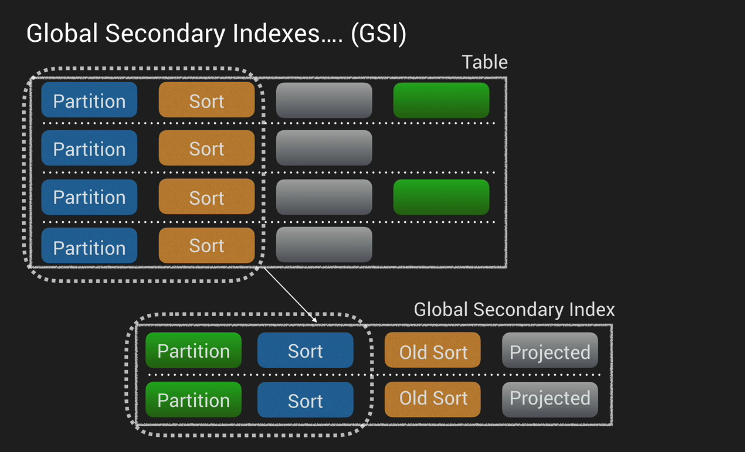

# DynamoDB

## Basics

- tables
    - items (like a row of data)
        - attributes (like a column of a data)

Nesting up to 35 level

## Capacity

Provisioned throughput capacity:
* write throughput $0.0065/h for every **10** units
* read throughput $0.0065/h for every **50** units
* 25 read/writes capacity units for free tier

Storage:
* First 25 Gb stored per month is free
* $0.25 Gb/month

```
Example:
capacity unit = 1 operation per second

1M writes/day -> 1M/(24h*60m*60s) = 11.6 rps = 12 write units = (0.0065/10)*12*24 = $0.1872 per day
1M reads/day -> 11.6 rps = 12 read units = (0.0065/50)*12*24 = $0,03744 per day

28 Gb = (25) + 3*0.25 = $0.75 per month

30 days * (0.1872 + 0,0374) + 0.75 = $7,488/month
```

## Provisioned throughput

* read provisioned throughput
    * all reads are rounded up increments to 4Kb
    * eventually consistent reads - 2 reads per second
    * strongly consistent reads - 1 read per second
* write
    * all writes are 1Kb
    * all writes consist of 1 write per second

example
```
to 10 items of 1kb per second using eventual consistency. What should you set the read throughput to?

1kb -> round to 4
4 Kb / 4Kb = 1 read unit per item

1x10 = 10 items
10/2 = 5 for eventual consistency
10 units for strong

10 x 6 kb per second eventual consistency

(( 8 / 4 ) * 10 )/ 2= 10 units for eventual

5 x 10 Kb per second eventual

(( 12 / 4 ) * 5 ) / 2 = 8 units for eventual

for writing:

5 items with each 10 kb data
5 x 10kb = 50 write units

```

When limit exceeded
`400 HTTP status code - ProvisionedThroughputExceededException`

limit exceeded for a table or for one or more global secondary indexes

A decrease is allowed up to four times any time per day

if there was no decrease in the past hour, an additional decrease is allowed, effectively bringing the maximum number of decreases in a day to 27 times (4 decreases in the first hour, and 1 decrease for each of the subsequent 1-hour windows in a day).


## Indexes

### Primary keys

#### Single attribute (unique ID)

Partition key/Hash key

- one attribute
- no two items can have the same partition key value
- The minimum length of a partition key value is 1 byte. The maximum length is 2048 bytes.

input to an internal hash function. Function output determines the partition (physical location)

#### Composite

Partition key && Sort Key (Hash & Range) composed of two attributes

- two items can have the same partition key, but they must have a different sort key
- all items with the same partition key are stored together, in sorted order by sort key value
- The minimum length of a sort key value is 1 byte. The maximum length is 1024 bytes.

----

#### Local secondary index


* the same partition key, different sort key
* can only be created during table creation. They cannot be removed or modified later
* max 5 indexes
* local secondary indexes share provisioned throughput with parent table
* any non key values by default aren't in a LSI
    - additional latency for item retrieval from main table
    - additional RCU for querying non-projected values
    - additional cost for retrieving whole item size from main table
    
* update in main table for LSI attirubutes -> 2 ops in LSI: remove/add row
* be aware of itemCollections
    - only applies to tables with LSIs
    - max size of a item collection is 10Gb
    - `ItemCollectionSizeLimitExceededException`
* changes are written async to the LSI from main table

#### Global secondary index
* has different partition key and different sort key
* can be added during table creation or added later
* own provisioned throughput
* max 5 indexes
* only eventually consistent reads
* Keys Only, Include to include attributes, ALL to include all attributes
* changes are written async to the GSI from main table
* could affect performance of main table if writes to GSI are throttled



## Streams

streams stored for 24 hours (max)
stream can trigger lambda functions

Used to capture any kind of modification of the DynamoDB table:
* new item added
* item updating
* item removal

### views
- KEYS_ONLY - only the key attributes are written to the stream
- NEW_IMAGE - entire item after update is written to the stream
- OLD_IMAGE - entire item prior to update is written to the stream
- NEW_AND_OLD_IMAGES - both states are written to the stream

## Replication


## Query vs Scan

### Query

query - by using only primary key attribute values, you must provide a partition attribute name and distinct value to search for

yuo can optionally provide a sort key attribute name and value, nand use a comparison operator to refine the search results.

by default query returns all attirubets. You can use `ProjectionExpression` param to return only some of the attributes.

You can project a total of up to 20 attributes into all of a table's local and global secondary indexes. This only applies to user-specified projected attributes.

Results are always sorted by the sort key. Sort order is ascending. To reverse the order, set the `ScanIndexForward` parameter to false

by default is eventually consistent but can be changed to be strongly consistent

### Scan

scan examines every item in the table.

## Web identity providers

1. web identity token (from identity provider)
2. App ID of provider
3. ARN of role

AssumeRoleWithWebIdentity Request -> AWS STS -> accesskeyid, secretaccesskey, sessiontoke, expiration (1 hour default), subjectfromwebidentity token (unique ID that appears in an IAM policy variable)

## conditional writes

update курильщика:

update здорового dynamodb:


if item = $10 then update to $12

cond. writes are idempotent

## Atomic counters

`UpdateItem`, atomic counter updates are not idempotent.

## Batch operations

`BatchGetItem` API (multiple tables, up 1 Mb of data, max 100 items)

## data types

Scalar/DynamoDB data types

- string
- number
- binary
- boolean
- null
- Document (List/Map): JSON
- Set: (array) ["red","green","blue"]

## DynamoDB partitions

- storage/processing node of ddb
- initially: one table == one partition
- max 10Gb data, 3000 RCU, 1000 WCU
- data distributed based on its hash/partition key
- no partition decrease when load/performance reduces
- allocated WCU/RCU are split between partitions (30k RCU -> 10 partitions, then reduce to 1k RCU -> 100 RCU per partition -> affects performance)

# to-do
- ItemCollections? `ItemCollectionSizeLimitExceedException`
- replication
- performance calculations, number of partitions, hot keys vs number of partitions
- burst capacity