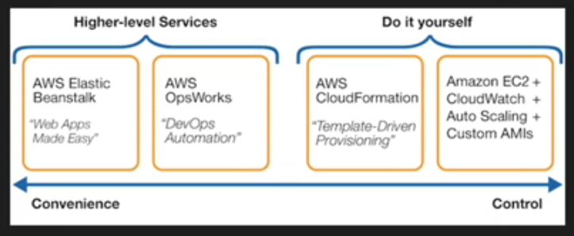
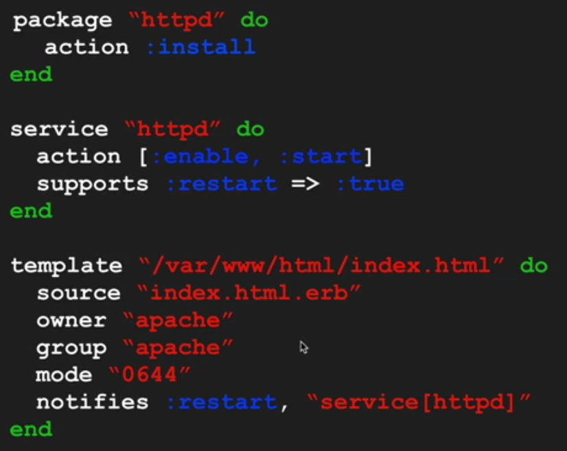
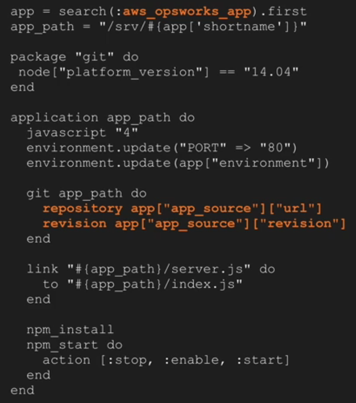
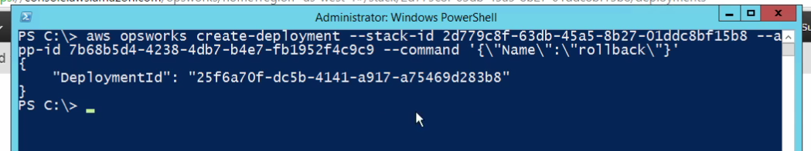

# OpsWorks

App mgmt service using chef.



automation:
- scale on time or load
- monitoring
- permissions and policy management

Chef server stores recipes as well as other config data

Client is installed on each server, VM, container, or networking device (nodes). Client polls server for latest policies.

- Stacks
  ```
  Container of resources, ELBs, EC2, RDS
  ```
  - can't mix linux and windows
  - can't change VPC/Region
  - default OS can be changed, but applies to new instances only
- Layers
  ```
  Layer exists within a stack and consists of things like a web app layer, app processing layer or database layer
  Create layer -> opsworks takes care of provisioning/configuring resources
  ```
  - types
    - opsworks
    - ECS
    - RDS
      ```
      For integration with existing RDS databases
      RDS instance can only be associated with one OPSWorks stack (?)
      Stack clone operation doesn't copy an existing RDS instance
      ```
  - 1 or more layers in the stack
  - instance must be assigned to a least 1 layer
  - which chef layers run, are determined by the layer the instance belongs to
  - preconfigured layers include:
    - Apps
    - DBs
    - ELBs
    - Caching
  - multiple apps per stack and per layer
- OpsWorks instances
- OpsWorkd Application
- Resources
  ```
  In this section you can register already existing resources (Elastic IP's, Volumes, RDS)
  ```

Under the hood:
- OpsWorks Agent (CHEF)
  - machine config
- OpsWorks automation engine
  - creating/updating/deleting various AWS infra
  - handling LB
  - autoscaling
  - auto healing
  - lifecycle events



## Instances

Instance types:
- 24/7 instances
- time based instances
- load based instances
    - first setup per-layer scaling configuration

## Lifecycle events

### Events:

- Setup
  ```
  Once a new instance has booted, AWS OpsWorks triggers the Setup event, which runs recipes to set up the instance according to the layer configuration.
  For example, if the instance is part of the PHP App Server layer, the Setup recipes install the Apache and PHP packages.
  Once setup is complete, AWS OpsWorks triggers a Deploy event, which runs recipes to deploy your application to the new instance.
  ```
- Configure
  ```
  When: Enters/Leaves online, EIP associate/disassociate, LB attach/detach
  Runs on all instances (in all layers) in deployment
  The event runs each layer's configure recipes to update the configuration to reflect the current set of online instances
  ```
- Deploy
  ```
  App deploy to layer instances, invoked by setup event
  ```
- Undeploy
  ```
  Delete an app, or undeploy command.
  ```
- Shutdown
  ```
  Graceful shutdown before termination
  ```

Events can be manually executed by the stack `run` command functionality. When event occurs, opsworks runs the set of recipes assigned to that event. Each layer has its own recipes for each event.

## Applications

- App name
- Document Root
- Data srouces
- Application srouce (git/http/s3)
- Env variables
- Domain names
- SSL settings

Deploy:
- executues deploy recipes
- application-id passed to the command
- app params are passed into the chef env
- deploy recipe accesses the app source info and pulls the app payload onto instance
- 5 versions of the app are maintained, current and four historic

## Create-deployment command

`aws opsworks --region abc create-deployment`

- `--stack-id`
- `--app-id`
- `--instance-ids`
- `--comment`
- `--generate-cli-skeleton`
- `--cli-input-json`
- `--command`
  * install_dependencies/update_dependencies
  * upgrade_operating_system (RHEL/Amazon Linux)
  * update_custom_cookbooks
  * execute_recipies
  * configure
  * setup
  * deploy/undeploy/rollback
  * start/stop/restart

##  Steps followed when provisioning an RDS instance

the layer can represent only existing RDS instances.

- create RDS instance
- register RDS with the stack
- attach layer to an app, which adds RDS instance's connection information to the app's deploy attributes
- use info from deploy attributes to connect app to the RDS instance

## Databags/BerkShelf

### BerkShelf

- only one custom cookbook repo for older version (<11.10)
- 11.10 added BerkShelf -> multiple repos allowed
- to enable -> enable custom cookbooks, Berksfile in root repo, which contains sources and custom cookbooks

### Databags

- global JSON objects
- multiple databags, **stack, layer, app, instance** levels
- accessed via the chef `data_bag_item` and `search` methods
- databags are constructed with the `custom_json` field
- databags can contain string, booleans, number, lists and JSON objects



databag types:
- aws_opsworks_(app|layer|instance|user)

## Autohealing

- each instance has an agent
- instance can be assigned to multiple layers, if autoheal is disabled in one layer -> instance is not eligible for autohealing
- instance -> heartbeat -> opsworks
- no heatbeat -> instance is unhealthy -> auto-heal
- configure event on all instances after auto-heal

EBS backed: online -> stopping -> stopped -> requested -> pending -> booting -> online
Instance store: terminate -> launch
  - terminate
  - launch new instance, same hostname, config, layer membership
  - reattaches any EBS volumes
  - new private/public IPs
  - EIPs reattached

does not:
- start_failed -> manual fix
- upgrade OS, even if default is changed
- check performance, only failures

after autohealing:
- opsworks runs "configure" event on entire stack

## CLI commands

- `aws opsworks describe-stacks` (only one API endpoint in us-east-1!)
- `aws opsworks describe-apps`
- `aws opsworks create-deployment`
    - rollback
      

### To register RDS instances with a stack

- In the AWS OpsWorks Stacks console, click Layer in the navigation pane, click + Layer or Add a layer to open the Add Layer page, and then click the RDS tab.
- If necessary, update the stack's service role, as described in Updating the Stack's Service Role.
- Click the RDS tab to list the available Amazon RDS instances.
- Select the appropriate instance, set User and Password to the appropriate user and password values and click Register to Stack.

If you change a registered Amazon RDS instance's password, you must manually update the password in AWS OpsWorks Stacks and then redeploy your apps to update the stack configuration and deployment attributes on the stack's instances.

#todo

- opsworks elb layer